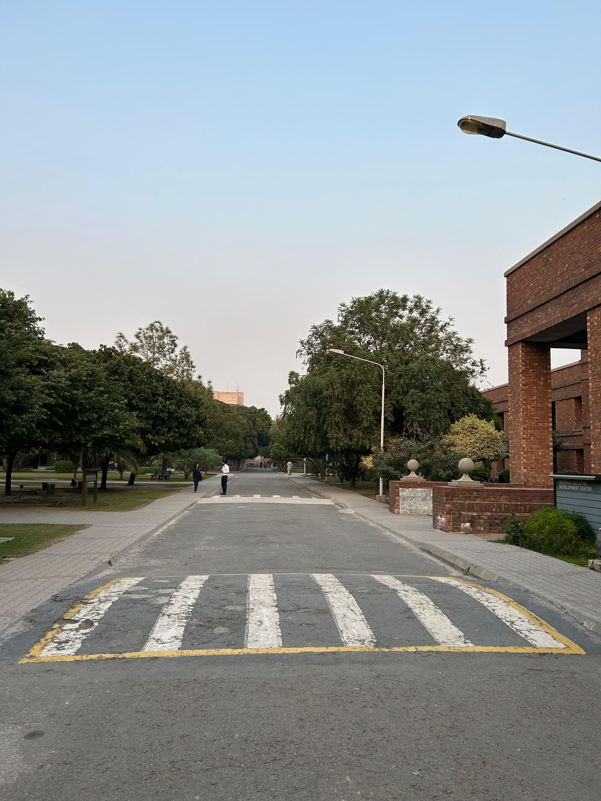
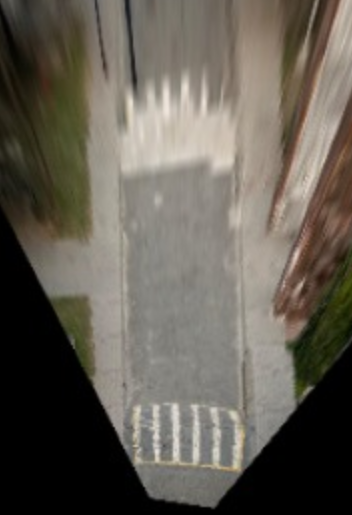

# dashvision

### This Project has the following components: 
 1. Lane Segmentation with YOLOP.
 2. Homography Image Projection.
 3. Apply Homography to our dataset captured in **Chauburji, Lahore**.
 4. SuperGlue Image Matching
 5. RANSAC Image Stitching
 4. Overlay on Satellite View Using Google Earth.

### A Sample Raw Homography Projection Inside LUMS

    

        
Dashcam

        

            
        

    

    

        
Bird Eye Projection 

        

            
        

    

## Important Files
**road_segmentation.ipynb** This file makes use of hustvl/yolop for segmenting roads from everything else.

**topViewGenerator.ipynb** This file helps in calculating homography of ground image to top image.

**Panorama_Stiching.ipynb** This file makes use of superglue to generate top view from ground view.
